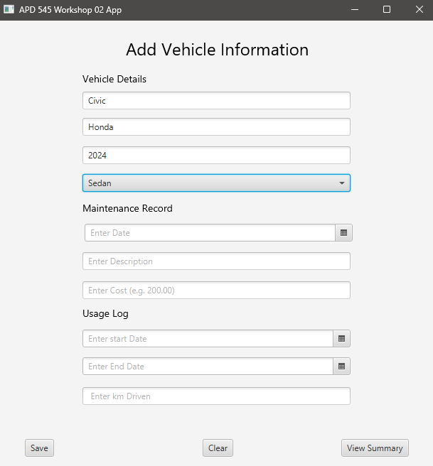
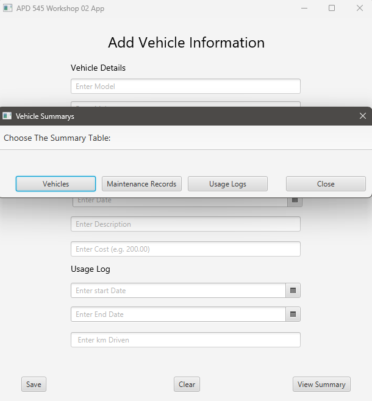
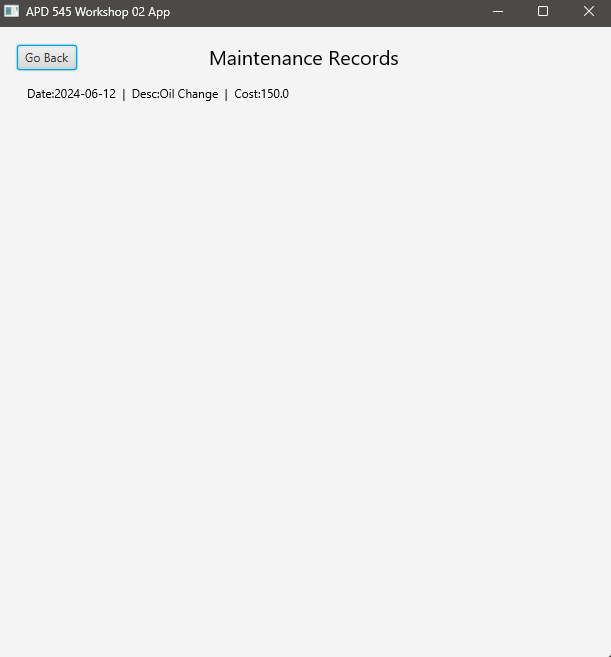

# Enterprise Rental Desktop Application

### About The App

The Enterprise Rental Desktop Application is a tiny light-weight desktop application
which uses JavaFX as the API for building the GUI of the application. 

Backend code is completely written in java while the frontend was developed using FXML files
in conjunction with a fxml drag-drop software known as Scene Builder which is compatible with
JavaFX. 

The reason for building this application was to explore application development using JavaFX,
explore the drag-drop software "Scene Builder", and to gain a better understanding of the
basics of desktop application development.

### Some Screenshots

### Project Structure

The project uses the MVC architecture to modularize the code. Since the project is 
self-contained, it opts for a file structure which allows all application elements to remain 
within the reach of the src folder. 
- controller: contains the main and only controller
- models: contains the records and model classes
- views: contains all FXML files
- test: contains the main class (launch point of the app)
